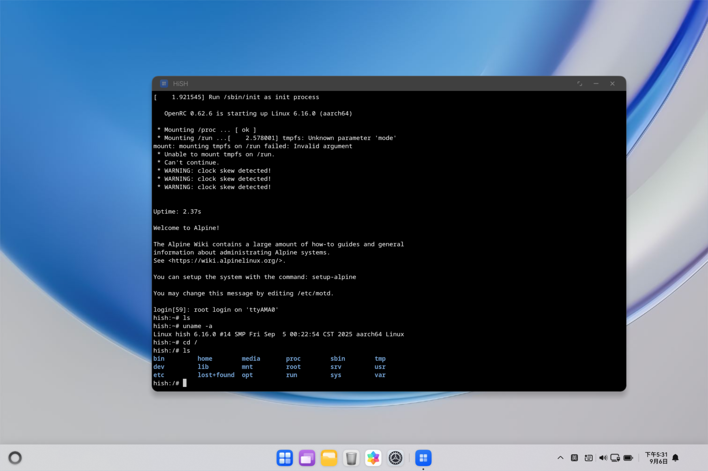
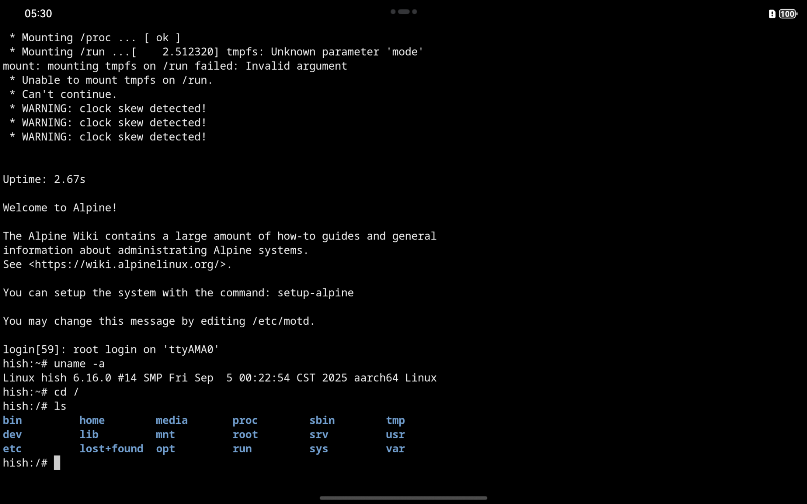
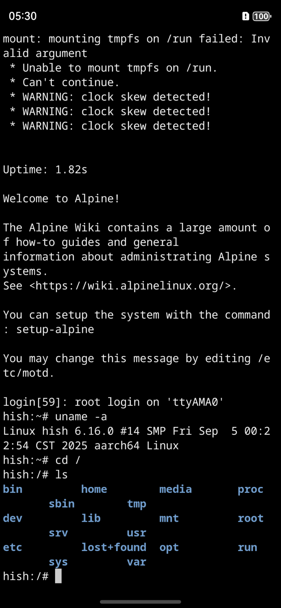

# HiSH

Run Linux Shell on HarmonyOS! Based on [harmony-qemu](https://github.com/hackeris/harmony-qemu), both 2in1(PC), Tablet and Phone are supported.

## How to use

Download hap from [Releases page](https://github.com/harmoninux/HiSH/releases) and signed by yourself, then install to your device or emulator.

## How to build

- Clone this repo to local
- Copy `build-profile.template.json5` to `build-profile.json5`
- Download files from [Releases page](https://github.com/harmoninux/HiSH/releases) and move to corresponding location as following
```bash
alpine_aarch64_rootfs.qcow2     # to entry/src/main/resources/rawfile/vm 
kernel_aarch64                  # to entry/src/main/resources/rawfile/vm
x86_64.libqemu-system-aarch64.so      # to entry/libs/x86_64/libqemu-system-aarch64.so
arm64-v8a.libqemu-system-aarch64.so   # to entry/libs/arm64-v8a/libqemu-system-aarch64.so
```
- Build project in DevEco Studio

## Screenshots

Screenshots of HiSH running on various HarmonyOS devices.

### 2in1(PC)



### Tablet



### Phone


