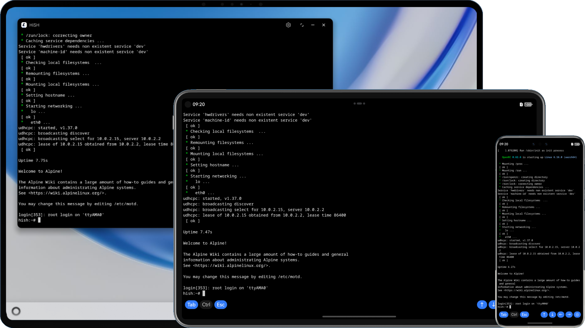

# HiSH

[GitHub](https://github.com/harmoninux/HiSH) | [GitCode](https://gitcode.com/realhackeris/HiSH) | [Gitee](https://gitee.com/hackeris/HiSH) | [English](README_EN.md)

在HarmonyOS设备上运行Linux Shell。基于[qemu-ohos](https://github.com/harmoninux/qemu)，支持2in1(PC)、平板和手机。



## 如何获取

可以选择下面任一方法获取HiSH：

- 通过[应用市场](https://appgallery.huawei.com/app/detail?id=app.hackeris.hish)安装（因应用市场政策限制，不支持JIT，运行效率一般）
- 从[Releases](https://github.com/harmoninux/HiSH/releases)下载hap文件，自行签名后安装到设备或模拟器（支持JIT，运行效率更高。安装方法见：[使用教程](https://github.com/harmoninux/HiSH/discussions/130)）
- 使用 DevEco Studio 编译源码安装，参考 [构建并安装HAP](#构建hap)（支持JIT，运行效率更高）

## 核心功能

- 完整的arm64 Linux内核
- 网络支持，并支持端口转发
- Alpine Linux根文件系统
- 虚拟按键（Tab/Ctrl/Esc/方向键）
- 共享文件夹
- JIT（仅开发者可用）
- 镜像导入（[Ubuntu24.04镜像](https://github.com/harmoninux/linux-config/releases/download/rootfs-20251213/ubuntu-base-24.04.zip) / [Debian12镜像](https://github.com/harmoninux/linux-config/releases/download/release-20251129-debian/debian12.zip)）

## 使用指南

参考 [使用指南](docs/guide)

## 讨论交流

微信群二维码


## 授权许可

使用本项目代码，按照[惯例](https://www.n.cn/share/r1/d256b59a563047a3a052e58042ae2547)需在软件本体"关于"中注明基于本项目（HiSH）以及本项目的仓库地址。

# 构建指南

- HAP包
- libqemu-system库（可选）
- Linux内核（可选）
- 根文件系统（可选）

## 构建HAP

* 下载安装 [DevEco Studio](https://developer.huawei.com/consumer/cn/deveco-studio/)
* 克隆代码到本地
* 复制`build-profile.template.json5`到`build-profile.json5`
* 下载以下文件到指定位置：
  - [entry/libs.zip](https://github.com/harmoninux/qemu/releases/download/hish-20260110/libs.zip)（解压到`entry/libs`）
  - [entry/src/main/resources/rawfile/vm/kernel_aarch64](https://github.com/harmoninux/linux-config/releases/download/rootfs-20260117/kernel_aarch64)
  - [entry/src/main/resources/rawfile/vm/rootfs_aarch64.qcow2](https://github.com/harmoninux/linux-config/releases/download/rootfs-20260117/rootfs_aarch64.qcow2)
* 在DevEco Studio中构建项目
* 签名后在设备或模拟器上运行。参考 [本地真机运行应用](https://developer.huawei.com/consumer/cn/doc/harmonyos-guides/ide-run-device) | [自动签名-未关联注册应用](https://developer.huawei.com/consumer/cn/doc/harmonyos-guides/ide-signing#section151231211105010)

## 构建libqemu-system（可选）

在Ubuntu或Windows的WSL2环境下构建自定义的`libqemu-system-aarch64.so`：

* 安装依赖：

```shell 
sudo apt install -y build-essential cmake curl wget unzip python3 libncurses-dev \
    git flex bison bash make autoconf libcurl4-openssl-dev tcl \
    gettext zip pigz meson 
```

* 从[华为开发者官网](https://developer.huawei.com/consumer/cn/download/)下载Linux版"Command Line Tools"
* 解压后将`TOOL_HOME`环境变量设置为解压目录
* 进入`deps`目录运行构建脚本`build.sh`（默认针对x86_64模拟器）：
    * 针对真机的构建（arm64-v8a），需要将`build.sh`脚本中的`OHOS_ARCH`改为`aarch64`，`OHOS_ABI`改为`arm64-v8a`
```shell 
cd deps 
./build.sh 
```
* 构建产物位于`deps/output`目录

## 构建Linux内核（可选）

* 安装依赖：

```shell 
sudo apt install build-essential gcc bc bison flex libssl-dev \
 libncurses5-dev libelf-dev gcc-aarch64-linux-gnu \
 clang lld llvm make 
```

* 克隆Linux内核源码：

```shell 
git clone --depth=1 -b v6.12 https://github.com/torvalds/linux 
```

* 下载内核配置：

```shell 
cd linux 
curl https://raw.githubusercontent.com/harmoninux/linux-config/refs/heads/master/arm64_virt > .config 
```

* 编译内核：

```shell
export KCFLAGS='-march=armv8.5-a+crc+crypto+lse+rcpc+rng+sm4+sha3+dotprod+fp16 -mtune=neoverse-n1 -O2 -falign-functions=64 -fno-strict-aliasing -mllvm -vectorize-loops -mllvm -force-vector-width=2'
env KCFLAGS="$KCFLAGS" make ARCH=arm64 CROSS_COMPILE=aarch64-linux-gnu- LLVM=1 LLVM_IAS=1 menuconfig
env KCFLAGS="$KCFLAGS" make ARCH=arm64 CROSS_COMPILE=aarch64-linux-gnu- LLVM=1 LLVM_IAS=1 -j$(nproc)
```

* 内核镜像位于`arch/arm64/boot/Image`，复制到项目对应目录

## 构建Linux根文件系统（可选）

以下是构建自定义根文件系统的完整流程

* 准备Alpine根文件系统

```shell 
# 创建目录并解压Alpine最小根文件系统 
mkdir alpine 
wget https://dl-cdn.alpinelinux.org/alpine/v3.22/releases/aarch64/alpine-minirootfs-3.22.1-aarch64.tar.gz 
tar xvf alpine-minirootfs-3.22.1-aarch64.tar.gz -C alpine 
```

* 创建磁盘镜像文件

```shell 
# 创建8GB大小的原始镜像文件（可根据需要调整大小）
qemu-img create -f raw rootfs.img 8G 
 
# 格式化为ext4文件系统 
mkfs.ext4 rootfs.img 
```

* 挂载并填充文件系统

```shell 
# 创建挂载点并挂载镜像 
sudo mkdir -p /mnt/rootfs 
sudo mount -o loop rootfs.img /mnt/rootfs 
 
# 复制Alpine文件系统内容 
sudo cp -a alpine/* /mnt/rootfs/
 
# 卸载镜像 
sudo umount /mnt/rootfs 
```

* 转换为qcow2格式

```shell 
# 转换格式（qcow2支持动态分配空间）
qemu-img convert -p -f raw -O qcow2 rootfs.img rootfs.qcow2 
```

* 部署到项目

```shell 
# 将生成的文件放入项目目录 
mkdir -p entry/src/main/resources/rawfile/vm/
mv rootfs.qcow2 entry/src/main/resources/rawfile/vm/rootfs_aarch64.qcow2 
```

# Star history

[](https://www.star-history.com/#harmoninux/hish&Date)
