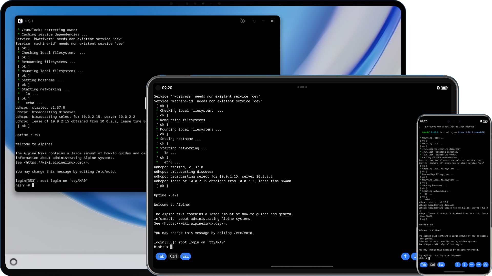

# HiSH

[Gitee](https://gitee.com/hackeris/HiSH) | [中文](README.md)

Run Linux Shell on HarmonyOS devices! Based on [harmony-qemu](https://github.com/hackeris/harmony-qemu), both 2in1(PC), Tablet and Phone are supported.



## How to get

You can try one of following methods to get HiSH:

- Download hap from [Releases page](https://github.com/harmoninux/HiSH/releases) and signed by yourself, then install to your device or emulator (JIT suported, runs faster).
- Install from [Invite Test of AppGallery](https://appgallery.huawei.com/link/invite-test-wap?taskId=166edd60d66c1006d7ef9565e449185e&invitationCode=A2w5fWZD2Wf)
- Build from source code in DevEco Studio, see [Build HAP](#build-hap)

## Core Features

- Complete arm64 Linux kernel
- Networking with port forwarding
- Alpine Linux rootfs
- Virtual Keys (Tab/Ctrl/Esc/Up/Down/Left/Right)
- Shared Folder
- JIT (Only available for developer)

# How to build

- HAP bundle
- libqemu-system (optional)
- Linux kernel (optional)
- rootfs (optional)

## Build HAP

- Clone this repo to local
- Copy `build-profile.template.json5` to `build-profile.json5`
- Download files and move to corresponding location as following
  - [entry/libs/arm64-v8a/libqemu-system-aarch64.so](https://github.com/harmoninux/HiSH/releases/download/release-20251022/arm64-v8a.libqemu-system-aarch64.so)
  - [entry/libs/x86_64/libqemu-system-aarch64.so](https://github.com/harmoninux/HiSH/releases/download/release-20251022/x86_64.libqemu-system-aarch64.so)
  - [entry/src/main/resources/rawfile/vm/kernel_aarch64](https://github.com/harmoninux/linux-config/releases/download/release-20251101/kernel_aarch64)
  - [entry/src/main/resources/rawfile/vm/rootfs_aarch64.qcow2](https://github.com/harmoninux/linux-config/releases/download/release-20251104/rootfs_aarch64.qcow2)
- Build project in DevEco Studio
- Sign and run in your device or emulator

## Build libqemu-system (Optional)

Build your own `libqemu-system-aarch64.so` for `entry/libs` on Ubuntu (or WSL2 on Windows), for customizing `libqemu`

- Install dependencies
```shell
sudo apt install -y build-essential cmake curl wget unzip python3 libncurses-dev \
		git flex bison bash make autoconf libcurl4-openssl-dev tcl \
		gettext zip pigz meson
```
- Download "Command Line Tools" for Linux from https://developer.huawei.com/consumer/cn/download/
- Extract downloaded zip and set TOOL_HOME env variable to `command-line-tools` directory
- Change current directory to `deps` and run `build.sh`, for x86_64 emulator default
  - For real devices, you can change target to arm64 in build.sh by modifying OHOS_ARCH and OHOS_ABI
```shell
cd deps
./build.sh
```
- See `*.so` files in `deps/output`
```shell
ls -lh output
```

## Build Linux Kernel (Optional)

Build your own Linux kernel for HiSH, for customizing Linux kernel

- Install dependencies
```shell
sudo apt install build-essential gcc bc bison flex libssl-dev \
 libncurses5-dev libelf-dev gcc-aarch64-linux-gnu \
 clang lld llvm make 
```
- Clone linux kernel source to local
```shell
git clone --depth=1 -b v6.16 https://github.com/torvalds/linux
```
- Download linux kernel build config
```shell
cd linux
curl https://raw.githubusercontent.com/harmoninux/linux-config/refs/heads/master/arm64_tinydocker > .config
```
- Build Linux kernel
```shell
env KCFLAGS='-march=armv8.5-a+crc+crypto+lse+rcpc+rng -mtune=cortex-a76 -O2 -falign-functions=64 -fno-strict-aliasing -mllvm -vectorize-loops -mllvm -force-vector-width=2' \
  make ARCH=arm64 CROSS_COMPILE=aarch64-linux-gnu- LLVM=1 LLVM_IAS=1 -j$(nproc)
```
- The kernel image is at `arch/arm64/boot/Image`, copy it to `entry/src/main/resources/rawfile/vm/kernel_aarch64`

## Build rootfs for Linux (Optional)

Build your own rootfs for HiSH

- Download and extract Alpine rootfs from [downloads | Alpine Linux](https://alpinelinux.org/downloads)
```shell
mkdir alpine
tar xvf alpine-minirootfs-3.22.1-aarch64.tar.gz -C alpine
```
- Use `qemu-img` to create a `rootfs.img` file
```shell
qemu-img create -f raw rootfs.img 8G
```
- Make fs for `rootfs.img` file
```shell
mkfs.ext4 rootfs.img
```
- Mount `rootfs.img` as directory
```shell
sudo mkdir /mnt/rootfs
sudo mount rootfs.img /mnt/rootfs
```
- Copy files of rootfs to `/mnt/rootfs`
```shell
sudo cp -r alpine/* /mnt/rootfs
```
- Unmount `/mnt/rootfs`
```shell
sudo umount /mnt/rootfs
```
- Convert raw img to qcow2 format
```shell
qemu-img convert -p -f raw -O qcow2 rootfs.img rootfs.qcow2
```
- Put `rootfs.qcow2` to `entry/src/main/resources/rawfile/vm/rootfs_aarch64.qcow2`

# Star History

[](https://www.star-history.com/#harmoninux/hish&Date)