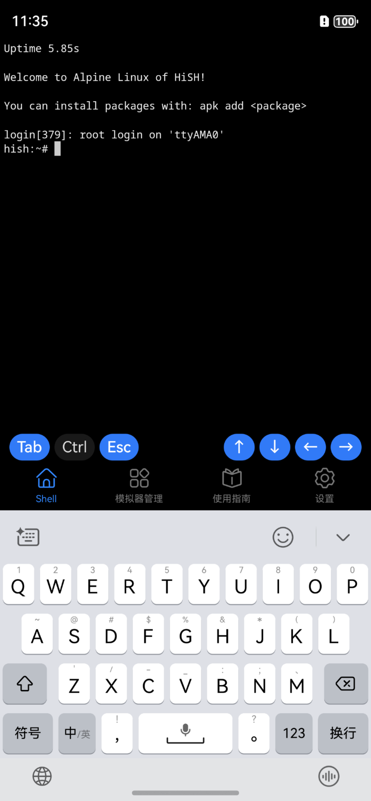
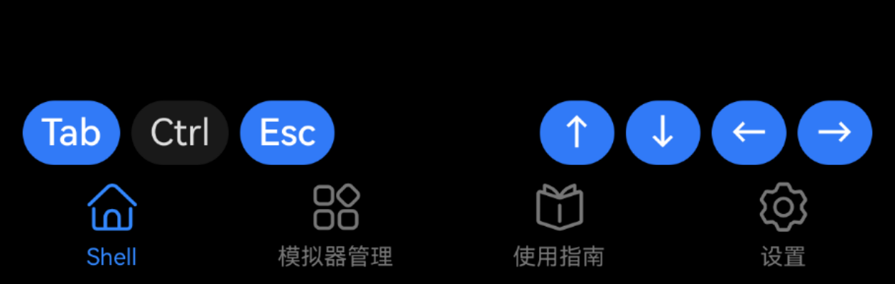

# Linux Shell

Linux Shell 是 HiSH 提供的核心功能，在 App 启动后，首屏所在的页面就是 Linux Shell。在 App 启动后，Linux Shell
大概在数3-5秒左右初始化完成，进入可用状态。如下：

您可以直接通过软键盘输入 Linux 命令，并按下“回车”或者“换行”执行。

## 虚拟按键

在 Linux Shell 下方，HiSH 提供了常见的“虚拟按键”，以便于在移动端（手机、平板）上使用，如下所示：

图中，左测虚拟按键分别为：Tab、Ctrl、Esc，其中 Ctrl 按下后会自动保持，直到用户按下其它键形成组合键后自动释放；右侧虚拟按键为方向键。

## Alpine Linux

HiSH 内置的 Linux 为 Alpine Linux 发行版，该发行围绕 musl libc 和 busybox 构建。这使得它比传统的 GNU/Linux 发行版更小，更节省资源。

尽管体积很小，Alpine Linux 还是提供了完整的 Linux 环境，其存储库中还包含了大量的软件包。

Alpine Linux 采用 apk 包管理器，关于 apk 包管理器，可以参考“包管理器”相关内容。

Alpine Linux 采用 OpenRC 进行服务管理，关于 OpenRC，可以参考“OpenRC”相关内容。

