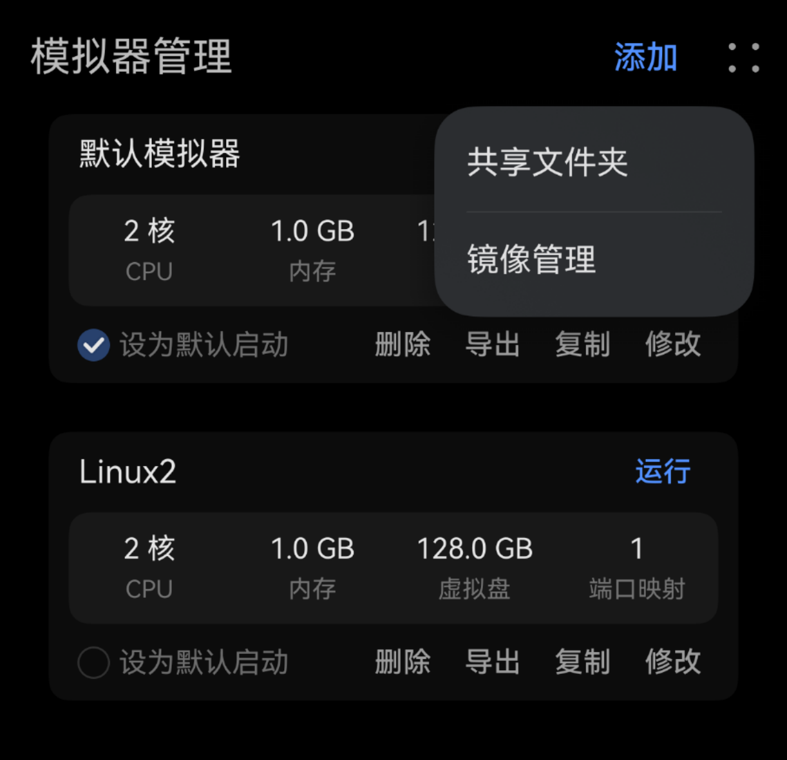

# 镜像管理

镜像管理用于维护创建模拟器时可以选择的镜像，创建模拟器时将以选择的镜像作为初始模板。

在“模拟器管理”标签也右上方，点击“更多”菜单图标，在展开的菜单中选择“镜像管理”即可进入：

在镜像管理中，支持了以下主要功能：

* 导入：允许用户导入自己制作的 qcow2 格式文件系统镜像
* 导出：支持将 qcow2 格式的镜像导出
* 删除：删除已有的镜像
* 重命名：修改镜像名称

## 使用镜像

在“模拟器管理”中创建模拟器实例时，在“镜像”配置中可以下拉选择“镜像管理”中可用的镜像。

