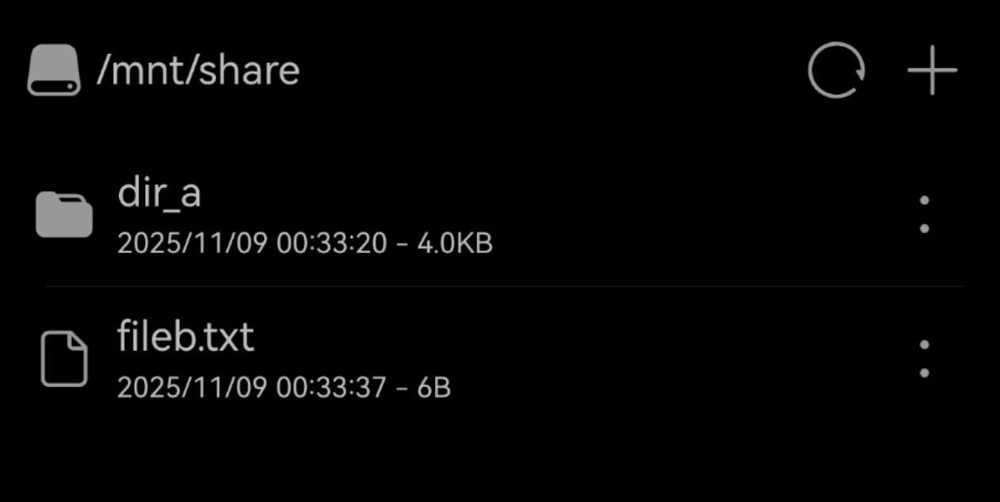

# 共享文件夹

HiSH 提供了共享文件夹的功能，模拟器中的Linux可以读写访问共享文件夹，用户可以将设备中的文件导入到共享文件夹中，也可以将共享文件夹中的文件导出到设备中，以此实现模拟器和外部进行较为安全的数据互通。

文件导入到共享文件夹后，默认在 Linux Shell 的 `/mnt/share` 下进行访问。

例如，在共享文件夹中创建一个 `dir_a` 文件夹，并导入一个 `fileb.txt` 文件：

在 Linux Shell 中，查看 `/mnt/share` 目录，即可看到共享文件夹中的内容:

另外，共享文件夹管理还支持 打开文件、删除文件和文件夹 等功能，便于用户对文件进行管理。

